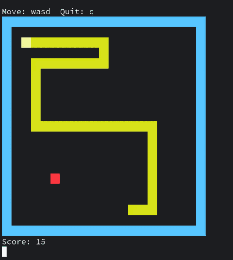

# snake_game_x86
A simple snake game implemented in x86_64 assembly language for Linux, demonstrating assembly programming concepts. It was created to explore low-level programming concepts and gain hands-on experience with assembly language.



## Precompiled Binary

A compiled version of the game is available for download from the [releases page](https://github.com/salmanmallah/snake_game_x86).

## Compilation and Installation

### Prerequisites  
Ensure that [NASM](https://www.nasm.us/) is installed on your system before proceeding.

### Code Section: Commands to Compile and Install  

To compile and install the game, execute the following commands:

```bash
git clone https://github.com/salmanmallah/snake_game_x86
```
```bash
cd snake-asm
```
```bash
sudo make install
```
